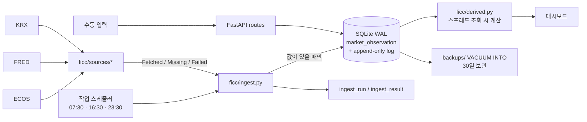

# ficc-desk

ECOS·FRED·KRX 세 곳의 REST API에서 원화·미국 금리, 환율, 크레딧, 국채선물을 하루 세 번 수집해 SQLite에 쌓고, 한 화면에 보여 주는 1인용 로컬 대시보드입니다.

### ▶ [화면 보기](https://seungkeemin.github.io/ficc-desk/)

링크는 고정 데이터로 만든 정적 재현본입니다. 실제 앱은 로컬에서 돌고, 화면은 한국어입니다.

## 과제 개요

FICC 데스크의 아침 루틴을 매일 같은 순서로 돌리기 위해 만들었습니다. 금리·FX·크레딧 수준을 한 화면에 두고, 그 옆에 페이퍼 포지션과 무효화 조건, 일일 체크리스트를 둡니다. 실제 자금은 없습니다. 목표는 수익이 아니라 기록입니다.

데이터 쪽에서 풀어야 했던 문제는 이렇습니다.

- 소스마다 게시 시각이 다릅니다. 같은 아침에 받아도 어떤 값은 오늘 것이고 어떤 값은 나흘 전 것입니다.
- 무료 API가 없는 값이 있습니다. 이런 값은 비슷한 다른 숫자로 채우지 않고 손으로 입력합니다.
- 수집은 자주 실패합니다. 한 소스가 죽어도 나머지는 저장돼야 하고, 실패가 0이나 이전 값으로 가려지면 안 됩니다.

## 접근 방식

### 설계 원칙

**결측은 행이 없는 것으로 표현합니다.** 값을 못 받으면 `market_observation`에 행을 만들지 않고 화면에 "미수집"으로 띄웁니다. 0이나 전일 값으로 채우지 않습니다.

**스프레드는 조회할 때 계산합니다.** 파생 필드 10개(국고 3-10, 본드-스왑, 한미 10년 금리차 등)는 DB에 저장하지 않습니다. 구성 원본이 하나라도 없으면 `None`입니다. 원본을 정정하면 스프레드도 따라 바뀝니다.

**덮어쓰기는 전부 로그에 남깁니다.** `market_observation_log`는 append-only이고 UPDATE·DELETE를 하지 않습니다. 자동 수집값을 손으로 고쳐도 이전 값과 출처가 남습니다. 재수집은 사람이 고친 값을 되돌리지 않습니다.

**API 코드는 실제 호출로 확인한 뒤에 고정합니다.** ECOS 통계표·항목코드, FRED 시리즈 ID, KRX 상품명은 `scripts/discover_*.py`로 호출해 본 뒤 `ficc/config/sources.py`에 확인 날짜와 실측값을 주석으로 남깁니다. 확인 전인 필드는 수동 입력으로 둡니다.

전체 규칙 7개는 [CLAUDE.md](CLAUDE.md)에 있습니다.

### 게시 지연과 관측일

수집 시각이 아니라 값의 실제 관측일을 `obs_date`로 저장하고, 화면에서는 셀마다 as-of 날짜를 띄웁니다. 소스별 지연은 2026-08-11 실제 호출로 확인했습니다(`sources.py` 주석).

| 소스 | 게시 지연 |
|---|---|
| ECOS 시장금리·환율(일별) | 당일. KOFR와 기준금리만 T+1 |
| FRED 국채금리(DGS*)·환율(DEX*) | 08-11 기준 최신 관측일 08-07 (4일) |
| FRED SOFR·OAS·VIX·BEI | 1일 |
| KRX 국채선물 | 최소 T+1. 08-11 18:58에 당일 행 0건 |

### 유럽 소스를 보류한 이유

ECB, 영란은행, 분데스방크 API를 호출해 확인했지만 채택하지 않았습니다. FRED에는 유럽 국채금리가 일별로 없습니다. ECB와 영란은행은 D일 값을 D+1에 게시해서 아침 수집 시점에는 2영업일 전 값이 최신입니다. 분데스방크만 D일에 게시합니다. 매일 아침 이틀 전 숫자를 띄울 가치가 있는지는 실사용 3주 뒤에 정하기로 했습니다. 확인 결과는 `scripts/discover_ecb.py`, `discover_boe.py`, `discover_bbk.py` docstring에 있습니다.

## 구현



```
ficc-desk/
├── ficc/
│   ├── sources/          수집기. base.py(결과 타입·HTTP), ecos.py, fred.py, krx.py
│   ├── config/
│   │   ├── sources.py    실호출로 확인한 소스 코드 34개 (확인일·실측값 주석)
│   │   └── settings.py   .env 파싱, KST, 날짜 형식
│   ├── ingest.py         수집 진입점 (python -m ficc.ingest)
│   ├── db.py             SQLite 접근, 덮어쓰기 로그
│   ├── derived.py        파생 스프레드 10개
│   ├── app.py, routes/   FastAPI 화면·조회·입력
│   └── templates/, static/
├── migrations/           001~005 SQL. 필드 정의(field_def) 시드 포함
├── scripts/
│   ├── stats.py          수집 횟수·관측치 수 집계 (이 README 수치)
│   ├── data_dictionary.py docs/data-dictionary.md 생성
│   ├── discover_*.py     소스 코드 확인용 실호출 스크립트
│   └── register_tasks.ps1, scheduled_run.ps1, backup.py
├── docs/
│   ├── data-dictionary.md  필드 41개 + 파생 10개 (자동 생성)
│   └── manual_fields.md    수동 필드 출처
└── tests/                177개. 수집기 테스트는 저장된 응답(JSON fixture)으로 네트워크 없이 돈다
```

### 수집 필드

| 소스 | 필드 수 | 내용 |
|---|---:|---|
| ECOS (한국은행) | 16 | 기준금리, KOFR, CD·CP 91일, 통안 1년, 국고 1~30년, 회사채 AA-·BBB- 3년, 원/달러·100엔·위안 |
| FRED (세인트루이스 연준) | 13 | UST 3개월~30년, SOFR, FF 목표 상단, 10년 BEI, 미 IG·HY OAS, 달러/엔, 유로/달러, VIX |
| KRX Data Marketplace | 5 | 국채선물 3·10·30년 종가, 3·10년 미결제약정 |
| 수동 입력 | 7 | 원화 IRS 1·3·5년, NDF 1개월, 스왑포인트 1개월, DXY, 한국 5년 CDS |
| 파생 (조회 시 계산) | 10 | 커브 스프레드, 본드-스왑, 크레딧 스프레드, 한미 금리차 |

DXY는 ICE 독점 지수라 무료 API가 없습니다. FRED의 broad dollar index(DTWEXBGS)는 구성과 가중치가 다른 숫자라 DXY 라벨로 넣지 않았습니다. 필드별 소스 코드와 확인일은 [docs/data-dictionary.md](docs/data-dictionary.md)에 있습니다.

API 키는 `.env`에만 둡니다(`.env.example` 참고). 키가 비어 있으면 그 소스의 필드만 건너뛰고 나머지는 수집합니다.

## 실행 결과

2026-09-30 기준 `scripts/stats.py` 출력입니다. 정기 수집의 마지막 회차는 2026-09-28 23:30이고, 2026-09-30에 아래 이슈 기록의 세 날짜를 다시 수집했습니다.

| 항목 | 값 |
|---|---:|
| 수집 실행 | 102회, 39일 (2026-08-11 ~ 2026-09-30) |
| 실행 상태 | ok 65 · partial 12 · failed 2 · 중간 종료 23 |
| 필드별 결과 | ok 2,913 · error 137 · miss 12 · 수동 전용 건너뜀 714 |
| 저장된 관측치 | 953행, 41개 필드, 관측일 48일 (2026-08-07 ~ 2026-09-28) |
| 소스별 관측치 | ECOS 464 · FRED 342 · KRX 140 · 수동 7 |
| 덮어쓰기 로그 | 962행 (값 변경 9건) |

## 결과 분석

자동 수집 필드의 시도 3,062건 중 2,913건(95.1%)이 값을 받았습니다. 오류 137건은 연결 실패 126건, 타임아웃 10건, HTTP 502 1건입니다. 오류는 12회 실행에 몰려 있고, 그중 2026-09-01 12:56·12:57 두 번은 세 소스의 34개 필드가 모두 연결 실패였습니다. 나머지 실행에서는 실패한 필드만 비고 다른 필드는 저장됐습니다.

덮어쓰기 로그 962행 중 값 변경은 9건이고, 모두 아래 국채선물 정정입니다. 나머지는 새 값 기록입니다. 재수집 때 값이 같으면 로그를 늘리지 않습니다.

**한계.** PC가 꺼져 있으면 그 회차는 수집하지 않습니다(놓친 회차를 몰아서 돌리지 않도록 설정). 수동 필드 7개는 입력한 날만 값이 있습니다. 국채선물은 게시 지연 때문에 항상 전일 종가입니다.

## 이슈 기록

**롤오버 주간에 국채선물 종가 자리에 스프레드 가격이 저장됨.** KRX 응답에서 같은 상품명 아래 결제월별 종목과 캘린더 스프레드가 함께 옵니다. 수집기는 거래량이 가장 큰 행을 최근월물로 골랐는데, 2026-09-10·11·14에는 스프레드(SP 2609-2612) 거래량이 가장 컸습니다. 그래서 3·10·30년 종가 9건에 선물 가격 대신 1 미만의 스프레드 가격이 저장됐고, 같은 날 미결제약정 12건은 스프레드 행에 값이 없어 miss가 됐습니다. 이 README를 쓰면서 DB를 집계하다 발견했습니다. 스프레드 행을 거래량 비교 전에 빼도록 고치고, 그날 응답 구조를 재현한 회귀 테스트를 넣었습니다. 2026-09-30에 고친 코드로 세 날짜를 다시 수집해 9건을 정정했습니다. 이전 값은 덮어쓰기 로그에 남아 있습니다. 다시 수집하면서 그날 비어 있던 필드 35건도 채워졌습니다.

**중간에 끝난 수집 23회.** 시작 기록만 있고 종료 기록이 없는 실행이 23회 있습니다. 모두 필드 결과가 41개보다 적어 도중에 멈춘 것으로 보이고, 그중 10회가 16:30 회차입니다. 원인은 확인 중입니다. 필드마다 따로 커밋하므로 받은 값까지는 저장되고, 멈춘 뒤의 필드는 다음 회차에 채워집니다.

**KRX 인증키 활성화 전 401.** 키를 발급받아도 서비스별 활용 승인이 나기 전에는 모든 호출이 401이었습니다. 인증키가 2026-08-11 활성화된 뒤 국채선물 호출이 열렸습니다. 채권 서비스(국채전문유통시장)는 활용 승인이 나지 않아 아직 401이고, 체결수익률은 붙이지 않았습니다.

**Windows에서 `localhost` 지연.** `localhost`가 IPv6(`::1`)로 먼저 풀리는데 uvicorn은 IPv4에만 떠 있어서 요청마다 실패 후 폴백을 기다렸습니다. 주소를 `127.0.0.1`로 바꿔 해결했습니다.

**`.bat` 파일의 한글 주석이 명령으로 실행됨.** cmd.exe가 코드페이지를 바꾼 뒤 배치 파일을 바이트 위치로 다시 읽으면서 한글 주석이 쪼개져 실행됐습니다. `.bat`에는 ASCII만 두고 로직은 `.ps1`로 옮겼습니다.

## 다음 단계

NH선물 REST API 수집기를 붙일 계획입니다. 수집기는 `fetch(field_key, target) -> Fetched | Missing | Failed` 함수 하나이고 `ingest.PROVIDERS`에 등록됩니다. `ficc/sources/nhfutures.py`를 추가하고, 실제 호출로 확인한 종목 코드를 `sources.py`에 확인일과 함께 적고, 필드를 마이그레이션으로 추가하면 나머지(저장, 로그, 화면)는 그대로 씁니다.

## 실행 방법

Windows, Python 3.14. FastAPI · Jinja2 · SQLite(WAL) · 순수 JS · pytest. Node, ORM, 빌드 단계는 없습니다. 마이그레이션은 기동 시 자동 적용됩니다.

```
python -m venv .venv
.venv\Scripts\python -m pip install -r requirements.txt
copy .env.example .env
.venv\Scripts\python -m uvicorn ficc.app:app --port 8787
.venv\Scripts\python -m ficc.ingest
```

`127.0.0.1:8787`을 엽니다. 키가 비어 있어도 화면은 뜨고 해당 소스만 건너뜁니다.

```
.venv\Scripts\python -m pytest
.venv\Scripts\python scripts\stats.py
.venv\Scripts\python scripts\data_dictionary.py
```

하루 세 번 자동 수집은 `scripts\register_tasks.ps1`로 작업 스케줄러에 등록합니다. `data/`(SQLite 파일), `backups/`, `.env`는 커밋하지 않습니다.

## 개발 방식

설계 문서([SPEC.md](SPEC.md))와 운영 규칙([CLAUDE.md](CLAUDE.md))을 먼저 쓰고, Claude Code로 단계별(Phase 1~3)로 구현했습니다. 단계마다 커밋했고, Phase 4부터는 3주 이상 매일 써 본 뒤에 진행한다는 게이트를 CLAUDE.md에 두었습니다. 포트폴리오 정리 단계에서도 Claude Code를 써서 테스트, 집계 스크립트, 데이터 사전 생성기, CI, 이 README를 추가했습니다.

검증은 이렇게 했습니다.

- 소스 코드는 실제 호출로 확인한 것만 넣었고, 확인일과 그날의 실측값을 코드 주석에 남겼습니다.
- 수집기 테스트는 저장된 응답으로 네트워크 없이 돕니다. 테스트가 실제로 오류를 잡는지 보려고 수집기를 일부러 망가뜨려 돌려 봤습니다. 최신값 대신 가장 오래된 값을 고르게 하기, FRED의 결측 표기 `.`를 0으로 읽기, KRX 상품명 부분일치, 거래량 비교 생략, ECOS 항목코드 복사 실수 다섯 경우 모두 테스트가 실패했습니다.
- README의 운영 수치는 `scripts/stats.py`로 실제 DB를 읽기 전용으로 열어 뽑았습니다.
- 공개 전에 커밋 기록 전체에서 API 키·토큰·비밀번호를 검색했고 발견된 것은 없습니다.
